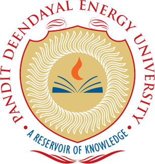

# 🎓 PDEU CSE Coursework Repository

  

  <b>Pandit Deendayal Energy University, Gandhinagar, Gujarat, India</b> 
  School of Technology 
  B.Tech Computer Science Engineering (Batch – 2024-28) 

---

⭐ **Star this repository if you found it helpful!** ⭐

---

## About This Repository

This repository serves as a **Central Hub** for all my academic coursework completed during my B.Tech journey (2024-28) at @ PDEU.

It contains **year-wise structured links** to repositories covering:
- Python Programming
- Object-Oriented Programming with C++
- Database Management System
- Data Structures & Algorithms
- And more...

## About Me

**Yashvardhan Jani**  
🎓 B.Tech CSE – Batch 2024-28 PDEU  
💡 Passionate about Development, AI/ML, Quantum Computing & Problem Solving 

🫱🏻‍🫲🏼 Connect with me:

---

## Year-wise Coursework

### 1️⃣ 1st Year :

#### 📘 Semester 2 :-
| Subject | Repository |
|--------|-----------|
| Python Programming | 🔗 [`View Repo`](https://github.com/YashvardhanJani/PDEU-PythonLab-Programs) |

### 2️⃣ 2nd Year :

#### 📘 Semester 3 :-
| Subject | Repository |
|--------|-----------|
| Object Oriented Programming (C++) | 🔗 [`View Repo`](https://github.com/YashvardhanJani/PDEU-CPP-OOP-Programs) |
| Data Structures | 🔗 [`View Repo`](https://github.com/YashvardhanJani/PDEU-DS-Lab-Programs) |
| Database Management System | 🔗 [`View Repo`](https://github.com/YashvardhanJani/PDEU-DBMS-LabWork) |
| Database Management System - Project | 🔗 [`View Repo`](https://github.com/YashvardhanJani/DBMS-Lab-Project) |

#### 📘 Semester 4 :-

Coming Soon...

---

## Code of Conduct

To maintain a respectful, inclusive and academically ethical environment, this project follows a formal Code of Conduct.

All contributors, students and participants are expected to adhere to these guidelines - please review the [Code of Conduct](CODE_OF_CONDUCT.md) before contributing.

## Contributing

Contributions are welcome! 🫱🏻‍🫲🏼 - see the [CONTRIBUTING](CONTRIBUTING.md) file for details.

> [!NOTE]
> This repository is intended to grow as a collaborative academic resource.  
> If there are any additions or updates to coursework in the future, contributors are welcome to enhance this repository by adding relevant content with clear mention of the academic year and semester of the update.

## License

This project is licensed under the **MIT License** - see the [LICENSE](LICENSE) file for details.

---

**Made with ❤️ by Yashvardhan Jani | CSE Student @ PDEU**

---

⬆️ [Back to Top](#top)

